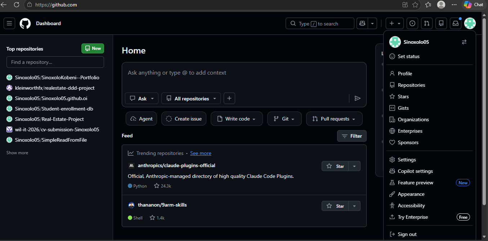
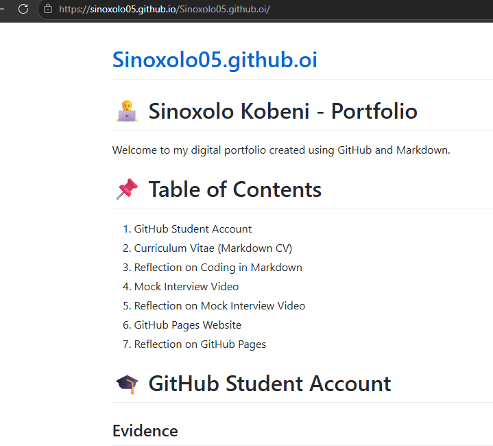

# 👨‍💻 Sinoxolo Kobeni - Portfolio

Welcome to my digital portfolio created using GitHub and Markdown.

# 📌 Table of Contents
1. GitHub Student Account
2. Curriculum Vitae (Markdown CV)
3. Reflection on Coding in Markdown
4. Mock Interview Video
5. Reflection on Mock Interview Video
6. GitHub Pages Website
7. Reflection on GitHub Pages

# 🎓 GitHub Student Account

## Evidence

🔗 [GitHub Profile](https://github.com/Sinoxolo05)

# 📄 Curriculum Vitae (Markdown CV)

📍 04 Boekenhout Street, Fisantekraal, Durbanville 7550  
📞 078 244 3225  
📧 230801846@mycput.ac.za  

## 🎯 Objective
Motivated IT student seeking an internship opportunity to gain practical experience in database management. Interested in applying knowledge of SQL, data organization, and database systems while contributing to efficient data management solutions.

## 🎓 Education

**Cape Peninsula University of Technology (CPUT)**  
Diploma in ICT: Application Development  
- 1st Year: 2024  
- 2nd Year: 2025  
- 3rd Year: 2026  

**Fisantekraal High School**  
Completed: 2022  

## 🛠️ Technical Skills
- MySQL (SELECT, INSERT, UPDATE, DELETE, JOIN)  
- Database Design (Tables & Relationships)  
- Java (NetBeans – Basic Programming)  
- Git & GitHub  

# 🧠 Reflection on Coding (CV) in Markdown (STAR Method)

## Situation
As part of my digital portfolio assignment, I was required to create and code my Curriculum Vitae using Markdown language on GitHub. This was my first time using Markdown to create a professional document online.

## Task
My task was to learn how Markdown works, structure my CV professionally, and publish it correctly on GitHub while ensuring that the information was easy to read and visually organized.

## Action
I researched basic Markdown syntax and learned how to use headings, bullet points, horizontal lines, hyperlinks, and image formatting. I created a GitHub repository and edited the README.md file to include my personal information, education, technical skills, and projects. I also practiced committing changes and updating my repository regularly to improve the layout and presentation of my CV.

## Result
I successfully created a professional CV using Markdown and published it on GitHub. Through this process, I improved my technical skills in GitHub, version control, and Markdown formatting. I also gained confidence in presenting myself professionally online and learned the importance of maintaining a clean digital portfolio.

## 🎥 Mock Interview Video

<iframe width="700" height="400"
        src="https://www.youtube.com/embed/VIDEO_ID"
        title="Mock Interview Video"
        frameborder="0"
        allowfullscreen>
    </iframe>

# 🧠 Reflection on Mock Interview Video (STAR Method)

## Situation
For this assignment, I was required to record a mock interview video to demonstrate my communication skills, confidence, and professionalism in an interview environment.

## Task
My task was to prepare professional answers to common interview questions, present myself confidently on camera, and communicate my skills and career goals clearly.

## Action
I prepared responses to possible interview questions such as introducing myself, explaining my strengths, and discussing my interest in the ICT field. I practiced speaking clearly and confidently before recording the video. I also ensured that my appearance and background were professional and recorded the interview multiple times to improve my performance.

## Result
The mock interview experience helped me improve my communication and presentation skills. I became more confident speaking in front of a camera and learned how important preparation is for interviews. The activity also helped me identify areas where I can improve professionally for future job opportunities and internships.

# 🌍 GitHub Pages Website

## Live Website
🔗 [Visit My GitHub Pages Website](https://sinoxolo05.github.io/Sinoxolo05.github.oi/
)

## Evidence

# 🧠 Reflection on the Use of GitHub Pages (STAR Method)

## Situation
As part of building my digital portfolio, I was required to publish my work online using GitHub Pages. This was my first experience creating and hosting a website through GitHub.

## Task
My task was to configure GitHub Pages correctly, publish my portfolio online, and ensure that all sections of my assignment were accessible through a live website link.

## Action
I learned how to enable GitHub Pages through the repository settings and selected the correct branch for publishing. I organized my portfolio using Markdown, added screenshots and links, and tested the website after publishing to ensure everything displayed correctly. I also made updates to improve the appearance and structure of the portfolio.

## Result
I successfully published my portfolio using GitHub Pages and gained practical experience in website hosting and online portfolio development. This activity improved my understanding of GitHub tools and showed me how developers can showcase their work professionally online. I now feel more confident using GitHub for future academic and professional projects.

# 📞 Contact Information

📧 230801846@mycput.ac.za  
📍 Durbanville, South Africa
